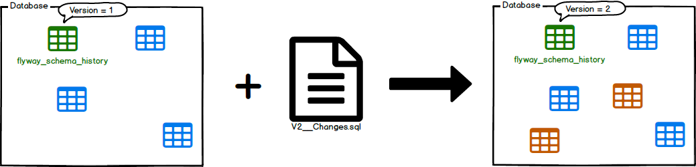
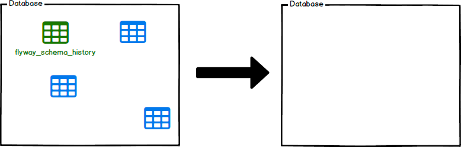
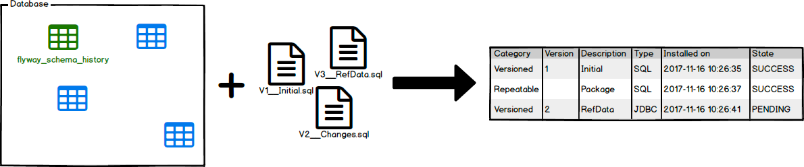
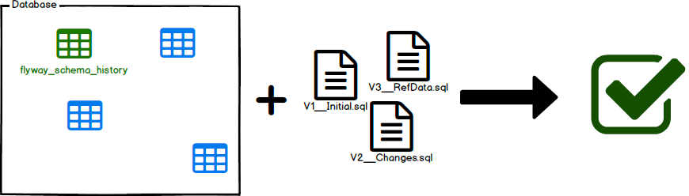
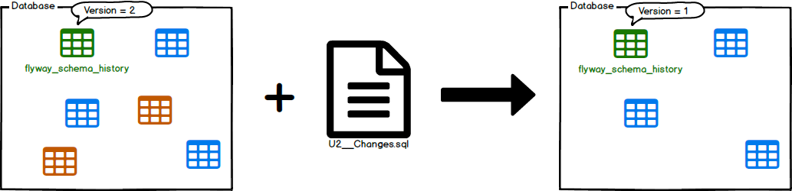
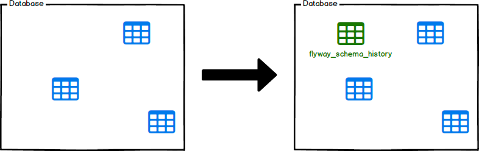
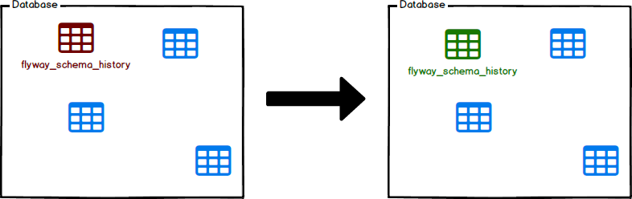

# Flyway (database migrations)

> Migrations can either be versioned or repeatable. The former has a unique version and is applied exactly once. 
The latter doesn't have a version. Instead, they are (re-)applied every time their checksum changes.

## Creating the Project
Spring-boot project with the following dependencies:
```
<dependency>
    <groupId>org.springframework.boot</groupId>
    <artifactId>spring-boot-starter-data-jdbc</artifactId>
</dependency>
<dependency>
    <groupId>com.h2database</groupId>
    <artifactId>h2</artifactId>
    <scope>runtime</scope>
</dependency>
<dependency>
    <groupId>mysql</groupId>
    <artifactId>mysql-connector-java</artifactId>
    <scope>runtime</scope>
</dependency>
```
### Configure the Flyway Maven Plugin

```
<plugins>
    <plugin>
        <groupId>org.flywaydb</groupId>
        <artifactId>flyway-maven-plugin</artifactId>
        <version>${flyway-maven-plugin.version}</version>
        <dependencies>
            <dependency>
                <groupId>com.h2database</groupId>
                <artifactId>h2</artifactId>
                <version>${h2.version}</version>
            </dependency>
        </dependencies>
    </plugin>
    <plugin>
        <groupId>org.springframework.boot</groupId>
        <artifactId>spring-boot-maven-plugin</artifactId>
    </plugin>
</plugins>
```

### Create an external configuration file
By default, configuration file name is flyway.conf and by default it loads configurations from:

- instalDir/conf/flyway.conf
- userhome/flyway.conf
- workingDir/flyway.conf

```
flyway.user=sa
flyway.password=
flyway.schemas=app-db
flyway.url=jdbc:h2:mem:DATABASE
flyway.locations=filesystem:db/migration
```

### Scripts
By default, flyway will load the .sql scripts from the **db/migration** directory.

The proposed naming convention is **`<Prefix><Version>\_\_<Description>.sql`**, where:
- `<Prefix>`: The default value is **V**, it can be changed by adding the `flyway.sqlMigrationPrefix` property.
- `<Version>`: Migration version number should always start with 1. Major and minor versions may be separated by underscore.
- `<Description>`: Textual description od the migration, a double underscore separates the version from the description:
  - `V1_0__create_employee_schema.sql`

### Disabling Flyway
Setting to false the `spring.flyway.enabled` in the **application.properties** file, will turn off the tool:

## Commands

### Migrate

Migrates the schema to the latest version. Flyway will create the schema history table automatically if it doesn't exist.



It will scan the filesystem for available migrations. It will compare them to migrations that have been applied to the database. 
If any difference found, it will migrate the database to close the gap.

Executing migrate is idempotent and can be done safely regardless of the current version of the schema.

**Example 1**: We have migrations available up to version 9, and the database is at version 5.
Migrate will apply the migrations 6, 7, 8 and 9 in order.

**Example 2**: We have migrations available up to version 9, and the database is at version 9.
Migrate does nothing.

### Clean

Drops all objects in the configured schemas **(ALL OBJECTS; tables, views, procedures...)**.



### Info

Prints the details and status information about all the migrations. Lets you know the current status, and check which 
migrations have been applied and which still pending, when were executed successfully or fail.



```
 mvn flyway:info
 +-----------+---------+-------------------------+------+---------------------+---------+
| Category  | Version | Description             | Type | Installed On        | State   |
+-----------+---------+-------------------------+------+---------------------+---------+
| Versioned | 1.0     | create employee schema  | SQL  | 2022-09-21 17:22:14 | Success |
| Versioned | 2.0     | create deparment schema | SQL  | 2022-09-21 17:22:14 | Success |
| Versioned | 3.0     | adding user role tables | SQL  | 2022-09-21 17:22:14 | Success |
+-----------+---------+-------------------------+------+---------------------+---------+

```

### Validate

Validates the applied migrations against the available ones.



Helps you verify that the migrations applied to the database match the ones available locally.

Validate works by storing a checksum (CRC32 for SQL migrations) when a migration is executed. 
The validate mechanism checks if the migration locally still has the same checksum as the
migration already executed in the database. 

### Undo


Undoes the most recently applied versioned migration.

### Baseline

Baselines an existing database, excluding all migrations up to and including baselineVersion



### Repair

Repairs the schema history table.



Tool to fix issues with the schema history table. It has a few main uses:

- Remove failed migration entries (only for databases that do NOT support DDL transactions)
- Realign the checksums, descriptions, and types of the applied migrations with the ones of the available migrations
- Mark all missing migrations as deleted
  - As a result, repair must be given the same locations as migrate!

## Summary
1. Database versions changes by using a collaborative like strategy.
2. Automates the DB updates and unify them with the app build process.
3. Flyway detects which version should be applied, is not necessary to specify the version. 
   1. Uses a metadata table where all the scripts executed are referenced.